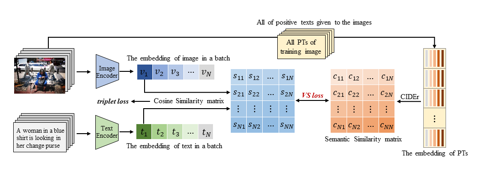
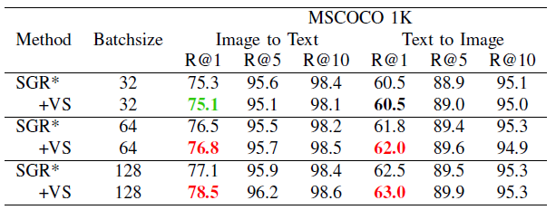
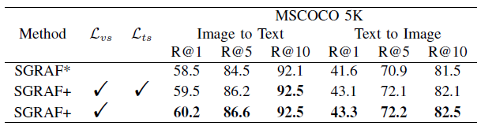

# Visual Semantic Loss (VSL)
*The code for ICME2023 paper of **“Image-text Retrieval via preserving main Semantics of Vision”**[[pdf]](https://arxiv.org/pdf/2304.10254.pdf).* 

*We proposed a semantical alignment strategy **Visual Semantic Loss(VSL)** for image-text retrieval. And we verify the effectiveness on top of two models proposed in [SGRAF](https://github.com/Paranioar/SGRAF).*


## Introduction

**The framework of VSL:**



**The experiments result:**

<table>
   <tr> <td rowspan="2">Dataset</td> <td rowspan="2", align="center">Method</td> 
        <td colspan="4", align="center">Image to Text</td> <td colspan="4", align="center">Text to Image</td> </tr>
   <tr> <td>R@1</td><td>R@5</td><td>R@10</td> <td>R@1</td><td>R@5</td><td>R@10</td> </tr>
   <tr> <td rowspan="3">MSCOCO1K</td>
        <td>SGR+VSL</td> <td>78.5</td><td>96.2</td><td>98.6</td> <td>63.0</td><td>89.9</td><td>95.3</td> </tr>
   <tr> <td>SAF+VSL</td> <td>78.3</td><td>96.0</td><td>98.6</td> <td>63.0</td><td>89.9</td><td>95.3</td> </tr>
   <tr> <td>SGRAF+VSL</td> <td>80.1</td><td>96.5</td><td>98.8</td> <td>64.8</td><td>90.7</td><td>95.9</td> </tr>
   <tr> <td rowspan="3">MSCOCO5K</td>
        <td>SGR+VSL</td> <td>57.7</td><td>84.3</td><td>91.0</td> <td>41.4</td><td>70.5</td><td>80.8</td> </tr>
   <tr> <td>SAF+VSL</td> <td>56.2</td><td>84.4</td><td>91.3</td> <td>41.4</td><td>70.4</td><td>81.0</td> </tr>
   <tr> <td>SGRAF+VSL</td> <td>60.2</td><td>86.6</td><td>92.5</td> <td>43.3</td><td>72.2</td><td>82.5</td> </tr>
   <tr> <td rowspan="3">Flickr30K</td>
        <td>SGR+VSL</td> <td>75.7</td><td>93.5</td><td>96.5</td> <td>56.5</td><td>80.9</td><td>85.9</td> </tr>
   <tr> <td>SAF+VSL</td> <td>75.9</td><td>93.9</td><td>97.5</td> <td>57.9</td><td>82.7</td><td>88.9</td> </tr>
   <tr> <td>SGRAF+VSL</td> <td>79.5</td><td>95.3</td><td>97.9</td> <td>60.2</td><td>84.3</td><td>89.4</td> </tr>   
</table> 

## Requirements 
*  Python 3.7  
*  [PyTorch==1.10.1](http://pytorch.org/)   
*  [CUDA==11.1](https://pytorch.org/get-started/previous-versions/) 
*  [NumPy==1.21.6](http://www.numpy.org/)   
*  [TensorBoard](https://github.com/TeamHG-Memex/tensorboard_logger)
*  h5py==3.1.0   
*  Punkt Sentence Tokenizer:

```python
import nltk
nltk.download()
> d punkt
```

## Download data and vocab
We follow [SCAN](https://github.com/kuanghuei/SCAN) and [SGRAF](https://github.com/Paranioar/SGRAF) to obtain image features and vocabularies, which can be downloaded by using:

```bash
wget https://iudata.blob.core.windows.net/scan/data.zip
wget https://iudata.blob.core.windows.net/scan/vocab.zip
```
Another download link is provided by SGRAF.

```bash
https://drive.google.com/drive/u/0/folders/1os1Kr7HeTbh8FajBNegW8rjJf6GIhFqC
```

## Pre-trained models and evaluation

Put the pretrained models into "./checkpoint".
### 1. The evaluation for pre-trained SGR+VSL and SAF+VSL models.
Modify the **model_path**, **data_path**, **vocab_path** in the `eval_single.py` file. Then run `eval_single.py`:

For example:

        evalrank(model_path="./checkpoint/SGR+VSL_COCO.pth.tar", data_path='./data', split="testall", fold5=True)

```bash
(For SGR+VSL and SAF+VSL) python eval_single.py
```

Note that `fold5=True` is only for evaluation on mscoco1K (5 folders average) while `fold5=False` for mscoco5K and flickr30K. Pretrained models and Log files can be downloaded from:

* [MSCOCO_SGR+VSL](https://drive.google.com/file/d/1kHAM2xP3ISYsnlbyHONFGMa8GqtSHrHe/view?usp=share_link) and [MSCOCO_SAF+VSL](https://drive.google.com/file/d/1_sBSfXSrtbbK27fYblY-nD5iZumy9oUq/view?usp=share_link).
* [Flickr30K_SGR+VSL](https://drive.google.com/file/d/1deaMYD3f2pP4tHiP0xtEOypL27Q5DEhU/view?usp=share_link) and [Flickr30K_SAF+VSL](https://drive.google.com/file/d/1UJjG0niQwqHVd32OQcAF9vkSI34pGINJ/view?usp=share_link).

### 2. The evaluation for pre-trained SGRAF+VSL model.
Modify the **sgr_model_path**, **saf_model_path**, **data_path**, **vocab_path** in the `eval_overall.py` file. Then run `eval_overall.py`:

For example:

        evalrank(sgr_model_path="./checkpoint/SGR+VSL_COCO.pth.tar", saf_model_path="./checkpoint/SAF+VSL_COCO.pth.tar", data_path='./data', split="testall", fold5=True)

```bash
(For SGRAF+VSL) python eval_overall.py
```

Note that `fold5=True` is only for evaluation on mscoco1K (5 folders average) while `fold5=False` for mscoco5K and flickr30K. Pretrained models and Log files can be downloaded from:

## Training new models
Modify the **data_path**, **vocab_path**, **model_name**, **logger_name** in the `opts.py` file. Then run `train.py`:

For MSCOCO:

```bash
(For SGR+VSL) python train.py --data_name coco_precomp --batch_size 128 --num_epochs 25 --lr_update 10 --learning_rate 0.0003 --module_name SGR

(For SAF+VSL) python train.py --data_name coco_precomp --batch_size 128 --num_epochs 25 --lr_update 10 --learning_rate 0.0003 --module_name SAF
```

For Flickr30K:

```bash
(For SGR+VSL) python train.py --data_name f30k_precomp --batch_size 128 --num_epochs 40 --lr_update 25 --learning_rate 0.0003 --module_name SGR

(For SAF+VSL) python train.py --data_name f30k_precomp --batch_size 128 --num_epochs 30 --lr_update 15 --learning_rate 0.0003 --module_name SAF
```

## Ablation

### 1. Ablation study for ***Data Diversity***

Modify the `--batch_size` to `32`, `64`, and `128`. The results on MSCOCO1K shows below.


### 2. Ablation study for ***Semantic similarity within the visual and textual modality.***

Modify the code in line 501-530, `model.py`. The results on MSCOCO5K shows below.


## Reference

If Visual Semantic Loss(VSL) is useful for you, please cite the following paper. 

Since ICME2023 has published the paper, please cite this official version of the paper. 

@INPROCEEDINGS{10219570,
  author={Zhang, Xu and Niu, Xinzheng and Fournier-Viger, Philippe and Dai, Xudong},
  booktitle={2023 IEEE International Conference on Multimedia and Expo (ICME)}, 
  title={Image-text Retrieval via Preserving Main Semantics of Vision}, 
  year={2023},
  volume={},
  number={},
  pages={1967-1972},
  doi={10.1109/ICME55011.2023.00337}}

  


